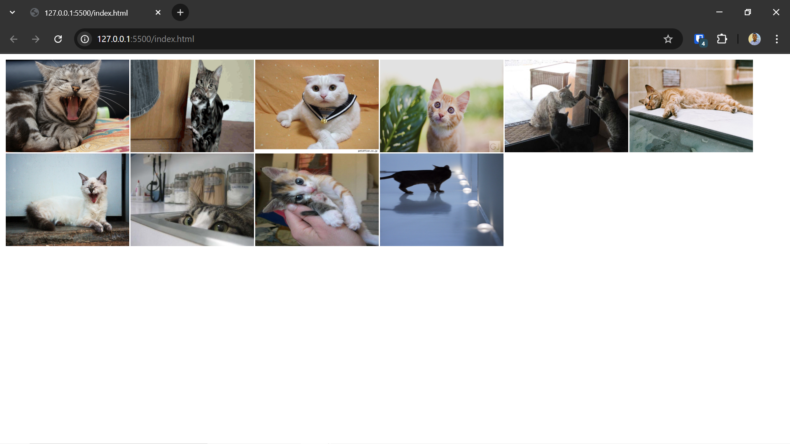

# Exercício Fetch API
## Descrição:
Construa uma comunicação com a fetch API para a url (https://api.thecatapi.com/v1/images/search?limit=10 ). Essa API retorna uma lista de objetos com 10 imagens aleatórias, sua missão será imprimir em um document.write todas as imagens com a seguinte formatação:

`“  ”`

**OBS**: 
    Para fazer a interação pela lista utilize forEach ou o laço for of.

A ideia será passar pelo array apenas para pegar a url_da_imagem e ir imprimindo em um document.write() a tag com a formatação dada acima.

A url_da_imagem virá em cada objeto dentro do array na propriedade url.

#### Para acessar a documentação da API acesse: 
`https://developers.thecatapi.com/view-account/ylX4blBYT9FaoVd6OhvR?report=bOoHBz-8t`

(**opcional**) Caso queira uma visualização melhor coloque na tag img o atributo width: Ex: width='200'

## Rodar a aplicação
### Pré-requisitos
Você vai precisar ter instalado em sua máquina o [Git](https://git-scm.com) e um editor para trabalhar com o código como [VSCode](https://code.visualstudio.com/).

### Clone o repositório:
`git clone https://github.com/josuesantos7/Backend-Exercicio-Fetch-API.git`

### Acesse o diretório:
`cd Backend-Exercicio-Fetch-API`

### Execute o arquivo Index.html:
`start index.html`

### Screenshot
